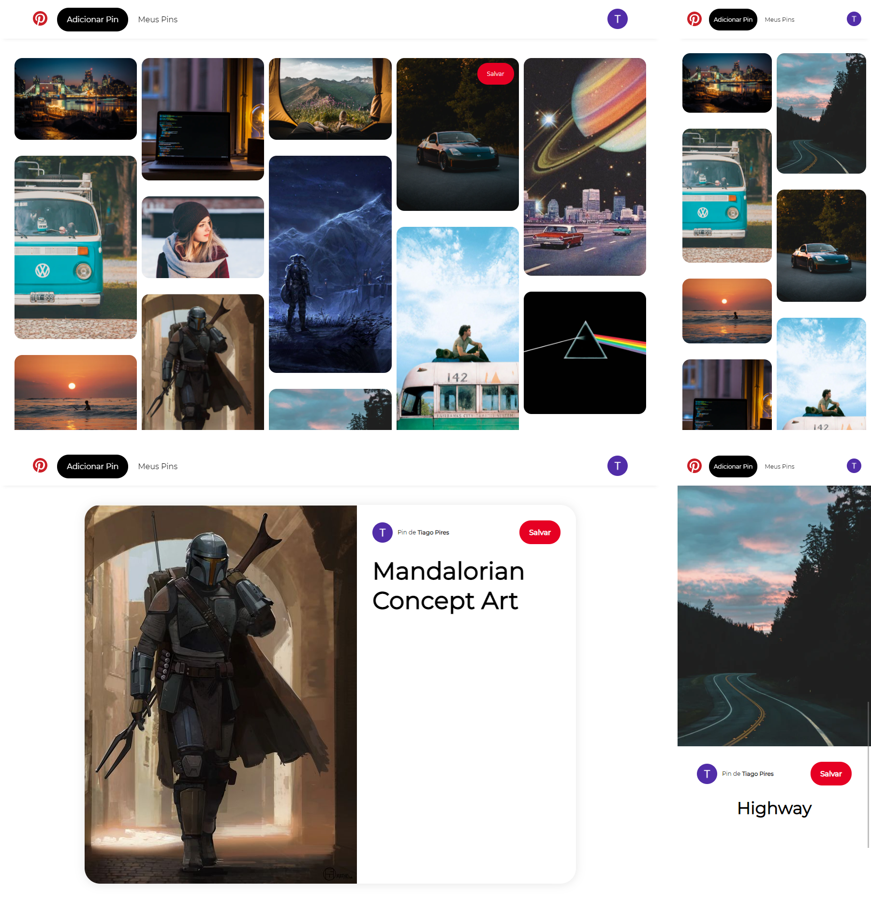

# Pinterest Clone
- [See this project working](https://pinterest-clone-tiagopires.herokuapp.com/)

## About this Project
GraphQL and Node.js clone of the website Pinterest.

## Functionalities
- See all pins created
- Create your own pins providing a title, description and image url
- See created Pins
- Delete your Pins
- Save Pins from other users
- See saved Pins
- Delete saved Pins
- Create an account using Google Authentication
- Login using Google Authentication

## Built With
 - [GraphQL](https://graphql.org/) - Query Language
 - [Passport](http://www.passportjs.org/) - Google Authentication
 - [Express-Session]( https://www.npmjs.com/package/express-session) - Manage Sessions
 - [Connect-Pg-Simple](https://www.npmjs.com/package/connect-pg-simple) - Store Sessions
 - [PostgreSQL](https://www.postgresql.org/) - Database
 - [Node-Postgres](https://node-postgres.com/) - Manage PostgreSQL Data
 - [Node.Js](https://nodejs.org/en/) - Server Side
 - [Express](https://expressjs.com/) - Authentication Routes

